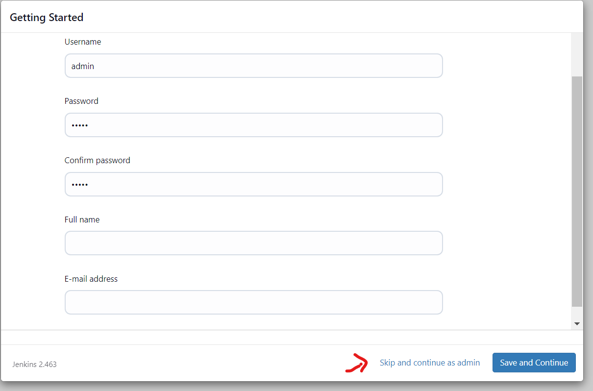
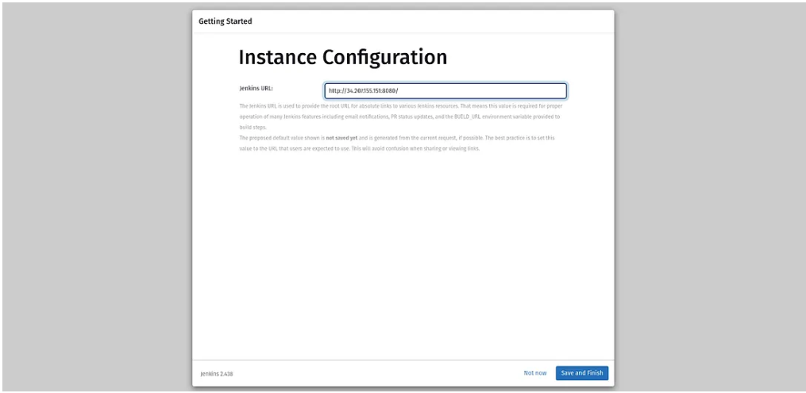
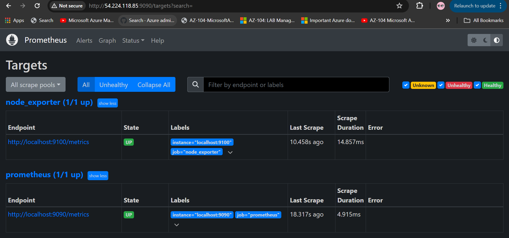
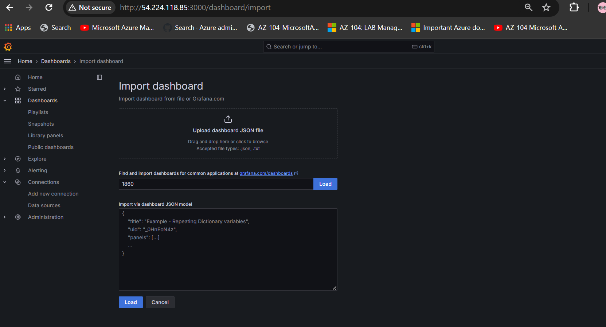
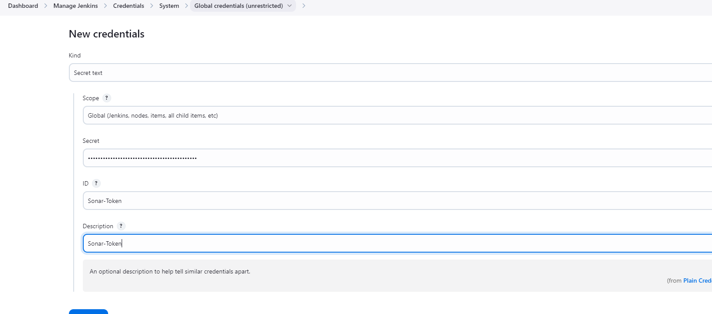
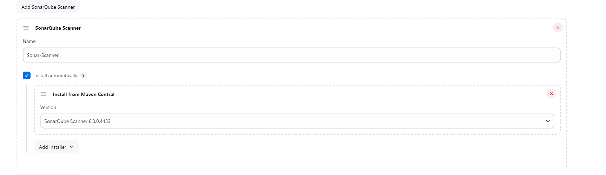
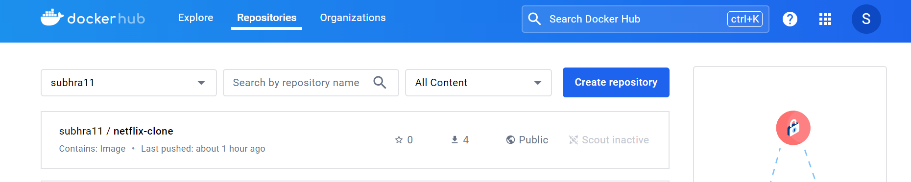
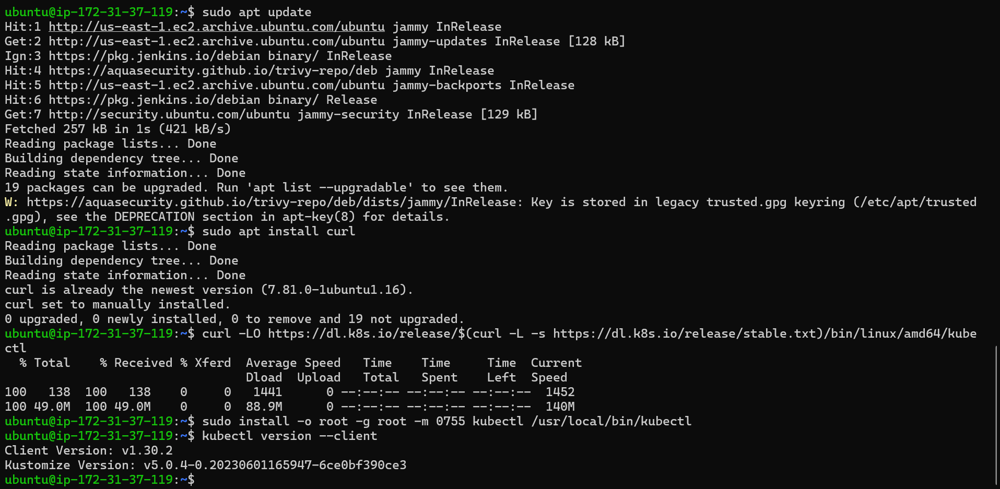

##--> Create an EC2 instance with the T2 large or more so teh JENKINS can be configured and the storge size 35 GB and more and have teh NSG inbound and the Outbound allowing all traffic communication ( Not recomemned for production )


--> Next we will create the Monitoring server . which will be created same as above ubuntu 22.04 and also make sure to have teh volume increased to 15 gb from 8gb . as 4 gb will be suffcient we will go with t2.medium .Have teh NSG inbound and the Outbound allowing all traffic communication ( Not recomemned for production )


##--> Now we will need to create 1 master node and 1 Worker node for teh Kubernets the setting remains same as the above monitoring server and the name needs to be chnaged and the number of instances should be 2 and teh Volume of 8 gb is sufficient 


# COnfigure the Jenkins server **
- Download Open install JDK on  Jenkins server
# Intsalling Java17
```sh
sudo apt update -y
sudo apt install openjdk-17-jre -y
java --version

# Installing Jenkins
curl -fsSL https://pkg.jenkins.io/debian/jenkins.io-2023.key | sudo tee \
  /usr/share/keyrings/jenkins-keyring.asc > /dev/null
echo deb [signed-by=/usr/share/keyrings/jenkins-keyring.asc] \
  https://pkg.jenkins.io/debian binary/ | sudo tee \
  /etc/apt/sources.list.d/jenkins.list > /dev/null
sudo apt-get update -y
sudo apt-get install jenkins -y

# Configuring Jenkins to Use Java 17
sudo update-alternatives --config java
# Ensure Java 17 is selected
sudo systemctl restart jenkins
# Configuring Jenkins to Use Java 17
sudo systemctl status jenkins


##SETUP JENKINS

*paste the Public ip of the jenkins server followed by " :8080" which will lead you to teh below screen and the password will be revealed an dthen next paste teh password in teh browser as in img-10

- run the command sudo cat /var/lib/jenkins/secrets/initialAdminPassword

Click continue and proceed with the installing plugins suggested 


Next you will have teh screen to setup the username and the password 
you can either set it up or you can proceed with selection as admin click finish on next screen and copy teh url an dlaunch it in browser 



##Install Docker and configure on the Jenkins Server

sudo apt update
sudo apt install docker.io -y
sudo usermod -aG docker jenkins
sudo usermod -aG docker ubuntu
sudo systemctl restart docker
sudo chmod 777 /var/run/docker.sock


##Install Sonarqube on your Jenkins Server
We can use a docker container for Sonarqube whcih is already present using teh belowcommand 
docker run -d --name sonar -p 9000:9000 sonarqube:lts-community


- Copy your Public IP of Jenkins Server and add 9000 Port on your browser.
- proceed with credentail as admin 

- Next it will prompt you to chnage teh password 

- Once you are done with chnaging the passsowrd you will land up to the below Home page 


##Install Trivy  on your Jenkins Server
- sudo apt-get install wget apt-transport-https gnupg lsb-release
- wget -qO - https://aquasecurity.github.io/trivy-repo/deb/public.key | sudo apt-key add -
- echo deb https://aquasecurity.github.io/trivy-repo/deb $(lsb_release -sc) main | sudo tee -a /etc/apt/sources.list.d/trivy.list
- sudo apt-get update
- sudo apt-get install trivy


* With this teh configuration of the Jenkins server comes to an end*

## ** <h1 style="font-size: 24px; font-weight: bold;">Monitoring Server Configuration</h1>
Configure MONITORING SERVER 

- Login to teh monitoring server 

- **1. Create the Prometheus User:**
Open a terminal and run the following command to create the Prometheus user:
```sh
sudo useradd --system --no-create-home --shell /bin/false prometheus


- ** Download the Prometheus file on the Monitoring Server **
wget https://github.com/prometheus/prometheus/releases/download/v2.49.0-rc.1/prometheus-2.49.0-rc.1.linux-amd64.tar.gz


- Untar the Prometheus downloaded package
tar -xvf prometheus-2.49.0-rc.1.linux-amd64.tar.gz
cd prometheus-2.49.0-rc.1.linux-amd64


# Move binaries
sudo mv prometheus promtool /usr/local/bin/

# Ensure rsync is installed
sudo apt-get install rsync

# Merge contents of consoles directory
sudo rsync -av consoles/ /etc/prometheus/consoles/

# Merge contents of console_libraries directory
sudo rsync -av console_libraries/ /etc/prometheus/console_libraries/

# Move prometheus.yml file
sudo mv prometheus.yml /etc/prometheus/

# Create Prometheus user if it doesn't exist
sudo useradd --system --no-create-home --shell /bin/false prometheus

# Create the data directory
sudo mkdir -p /data

# Ensure Prometheus user has the correct permissions
sudo chown -R prometheus:prometheus /etc/prometheus/ /data/

# Create systemd service file
sudo vim /etc/systemd/system/prometheus.service

[Unit]
Description=Prometheus
Wants=network-online.target
After=network-online.target
StartLimitIntervalSec=500
StartLimitBurst=5

[Service]
User=prometheus
Group=prometheus
Type=simple
Restart=on-failure
RestartSec=5s
ExecStart=/usr/local/bin/prometheus \
  --config.file=/etc/prometheus/prometheus.yml \
  --storage.tsdb.path=/data \
  --web.console.templates=/etc/prometheus/consoles \
  --web.console.libraries=/etc/prometheus/console_libraries \
  --web.listen-address=0.0.0.0:9090 \
  --web.enable-lifecycle

[Install]
WantedBy=multi-user.target


# Paste configuration into the file and save

# Enable and start Prometheus service
sudo systemctl enable prometheus.service
sudo systemctl start prometheus.service
systemctl status prometheus.service


# Once the Prometheus service is up and running, copy the public IP of your monitoring server and paste it into your favorite browser, followed by port 9090.


# Next we should be installing  node exporter to visualize the machine or hardware level data such as CPU, RAM, etc on our Grafana dashboard

- Open a terminal and run the following command to create the Prometheus user:
```sh
sudo useradd --system --no-create-home --shell /bin/false node_exporter


# Download the node exporter package
wget https://github.com/prometheus/node_exporter/releases/download/v1.7.0/node_exporter-1.7.0.linux-amd64.tar.gz


# Untar the node exporter package file and move the node_exporter directory to the /usr/local/bin directory

tar -xvf node_exporter-1.7.0.linux-amd64.tar.gz
sudo mv node_exporter-1.7.0.linux-amd64/node_exporter /usr/local/bin/


# Validate the version of the node exporter
node_exporter --version

#now we have t0 Create the systemd configuration file for node exporter.
Edit the file using teh below command and the content
sudo vim /etc/systemd/system/node_exporter.service

# Copy the below configurations and paste them into the /etc/systemd/system/node_exporter.service file.

[Unit]
Description=Node Exporter
Wants=network-online.target
After=network-online.target
StartLimitIntervalSec=500
StartLimitBurst=5

[Service]
User=node_exporter
Group=node_exporter
Type=simple
Restart=on-failure
RestartSec=5s
ExecStart=/usr/local/bin/node_exporter \
  --collector.logind

[Install]
WantedBy=multi-user.target


# Enable the node exporter systemd configuration file and start it.
Enable the node exporter systemd configuration file and start it.

sudo systemctl enable node_exporter
sudo systemctl enable node_exporter
systemctl status node_exporter.service

# Start the service manually and check its status if teh above does not work 
sudo systemctl start node_exporter.service
systemctl status node_exporter.service


# Now, we have to add a node exporter to our Prometheus target section. So, we will be able to monitor our server.

edit the file
sudo vim /etc/prometheus/prometheus.yml
Copy the content in the file

  - job_name: "node_exporter"
    static_configs:
      - targets: ["localhost:9100"]


# After saving the file, validate the changes that you have made using promtool.
promtool check config /etc/prometheus/prometheus.yml


# If your changes have been validated then, push the changes to the Prometheus server.
curl -X POST http://localhost:9090/-/reload


# Now, go to your Prometheus server and this time, you will see one more target section as node_exporter which should be up and running.


# Now, install the Grafana tool to visualize all the data that is coming with the help of Prometheu
# Add the Grafana APT repository
sudo apt-get install -y software-properties-common
sudo add-apt-repository "deb https://packages.grafana.com/oss/deb stable main"

# Add the Grafana GPG key
sudo wget -q -O - https://packages.grafana.com/gpg.key | sudo apt-key add -

# Update the package list
sudo apt-get update

# Install Grafana
sudo apt-get install grafana

# Enable and start the Grafana service
sudo systemctl enable grafana-server
sudo systemctl start grafana-server

# Check the status of the Grafana service
sudo systemctl status grafana-server


# Installed GRAFANA


# Now To access the Grafana dashboard, copy the public IP address of the Monitoring Server and paste it into your favorite browser with port 3000

username and password will be admin
once you reset the passowrd 
you will land upto this page


- click on teh datasources
- Click on Prometheus 
\
-Enter the valid url with the public ip of the Monitoring server 

- scroll down and confrim the settings click on save and test 

- Next click on teh dashboard option on the left pane

- click on teh create dashboard

- click on teh import dashboard and it will take you to this screen 

- Add 1860 for the node exporter dashboard and click on Load.

- select prometehus and enable teh monitoring by clicking import

- And teh grafana monitoring screen for teh monitoring sevrer appears 


- Now, we will add the Jenkins server to Grafana monitoring by including it as a target in the prometheus.yml file and before that making it compatible to send logs 
Go to Manage Jenkins -> Plugin search for Prometheus metrics install it and restart your Jenkins


- Go to Manage Jenkins > Configure System.
Scroll down to the Prometheus section and make sure the Expose Prometheus metrics box is checked.
Ensure the Metrics path is set to /prometheus.


- next Edit the /etc/prometheus/prometheus.yml file
sudo vim /etc/prometheus/prometheus.yml
- job_name: "jenkins"
metrics_path: "/prometheus"
static_configs:
    - targets: ["<jenkins-server-public-ip>:8080"]


- next run the below command to verify if teh file is correct and has no errors
promtool check config /etc/prometheus/prometheus.yml


- Now, push the new changes on the Prometheus server
curl -X POST http://localhost:9090/-/reload
promtool check config /etc/prometheus/prometheus.yml
 sudo systemctl restart prometheus


- Now once you reload teh monitoring server you shoudl see in target jenkins serve been added 


- Next go to the grafana GUI--> click on the  new dashboard --> import dashboard --> fill in the Find and import dashboards for common applications at grafana.com/dashboards with code 9964 -> click LOad


- And Finally teh dashboard arrives 


### Now, we have to integrate Email Alert. So, if our Jenkins pipeline will succeed or fail we will get a notification alert on our email.

what we need to install is the Jenkins Plugin, whose name is Email Extension Template.
Manage Jenkins -> Plugins and install the Email Extension Template plugin.


# After installing the plugin, follow these steps to configure your email service:

Access Your Email Account: 

Log in to your email account.
- Navigate to the account management section by clicking on "Manage account."


To Set Up App Passwords:
- In the Security section, find and click on "App passwords."

When prompted, enter your email account password.
Provide a name for the app you are integrating with the email service.
Generate and Secure Your App Password:


Gmail will generate an app password for you.
Copy the generated password and store it securely.
Configure Jenkins Email Settings:

Add your email ID and the app password generated in the previous step.
Update Jenkins Credentials:

Go to Manage Jenkins > Credentials.
Click on the (global) domain to add the new credentials.


Now, we have to configure our mail for the alerts.
Go to Jenkins -> Manage Jenkins -> System
Search for Extend E-mail Notification.
Provide the smtp.gmail.com in the SMTP server and 465 in the SMTP port


##Now, On the same page Search for  E-mail Notification.

Provide the smtp.gmail.com in the SMTP server and 465 in the SMTP port.
Select Use SMTP Authentication and provide the Gmail ID and its password in the Username and password.
To validate whether Jenkins can send the emails to you or not, check the Test configuration by sending a test e-mail


You should receive a test email like below once you trigger test email


### Next we will be building teh JEnkins Pipeline 
- Before that we need to install teh below mentkoned plugins on the Jenkins server 
Eclipse Temurin installer
SonarQube Scanner
NodeJS
CloudBees Disk Usage Simple


- Now head to Manage Jenkins -> Tools

- Click on Add JDK and provide the following things below


- Click on Add NodeJS and provide the following things below


##Now, we will configure Sonarqube
- To access the sonarqube, copy the Jenkins Server public IP with port number 9000
Then, click Administration --> thenn click Security and click on Users.


- Click on the highlighted blue box on the right to generate the token


- Now, add the token to your Jenkins credentials
Go to Manage Jenkins -> Credentials.
Select the Secret text in Kind.
Provide your token then provide the ID as sonar-token to call the credentials


- Go to Manage Jenkins -> System
Click on Add Sonarqube  and add the details in image below 


Go to Manage Jenkins -> Tools
CLik and go to  Sonarqube Scanner and click on Add and add the details in image below 


To create a webhook, go to the sonarqube gui click on Configuration and select Webhooks.
click create and Provide the name and Jenkins URL like below and click on Create.


# Craete a project in teh SonarQube
To create a project, click on Manually.


This is how the settings will be there to setup teh project  


###Next move to create teh Jnekins pipeline
Name and choose pipeline


Next write the beow pipeline code to only check the code using the SonarQube

pipeline {
    agent any
    tools {
        jdk 'jdk'   // Ensure 'jdk' is configured in Jenkins
        nodejs 'nodejs'  // Ensure 'nodejs' is correctly configured
    }
    environment {
        SCANNER_HOME = tool 'Sonar-Scanner'  // Ensure 'Sonar-Scanner' is correctly configured
    }
    stages {
        stage('Workspace Cleaning') {
            steps {
                cleanWs()
            }
        }
        stage('Checkout from Git') {
            steps {
                git branch: 'master', url: 'https://github.com/laharisu/Netflix-Clone-K8S-Devsecops-Deployment.git'
            }
        }
        stage('SonarQube Analysis') {
            steps {
                withSonarQubeEnv('Sonar-server') {  // Ensure the SonarQube server name matches the one configured in Jenkins
                    sh ''' 
                        ${SCANNER_HOME}/bin/sonar-scanner -Dsonar.projectName=Netflix-app \
                        -Dsonar.projectKey=Netflix-app
                    '''
                }
            }
        }
        stage('Quality Gate') {
            steps {
                script {
                    timeout(time: 10, unit: 'MINUTES') { // Set appropriate timeout
                        waitForQualityGate abortPipeline: true, credentialsId: 'Sonar-Token'
                    }
                }
            }
        }
        stage('Install Dependencies') {
            steps {
                sh 'npm install'
            }
        }
    }
    post {
        always {
            emailext attachLog: true,
                subject: "'${currentBuild.result}'",
                body: "Project: ${env.JOB_NAME}<br/>" +
                      "Build Number: ${env.BUILD_NUMBER}<br/>" +
                      "URL: ${env.BUILD_URL}<br/>",
                to: 'subhralikesfun@gmail.com',
                attachmentsPattern: 'trivyfs.txt,trivyimage.txt'
        }
    }
}


## Now, we have to add one more tool for our application named OWASP Dependency-check.
Go to Manage Jenkins -> Plugins
Search for OWASP Dependency-Check and install it

## After installing, make sure to configure the OWASP.
Provide the name select the latest version of OWASP and click on Save
add teh details in teh manage jenkins --> Tools 


No edit the Pipeline to introduce teh dependecy check using OWASp which should be placed above the Post fucntion whoch is used for sending emails

pipeline {
    agent any
    tools {
        jdk 'jdk'   // Ensure 'jdk' is configured in Jenkins
        nodejs 'nodejs'  // Ensure 'nodejs' is correctly configured
    }
    environment {
        SCANNER_HOME = tool 'Sonar-Scanner'  // Ensure 'Sonar-Scanner' is correctly configured
    }
    options {
        timeout(time: 60, unit: 'MINUTES')  // Global timeout for the pipeline
        timestamps()  // Add timestamps to the log
    }
    stages {
        stage('Workspace Cleaning') {
            steps {
                script {
                    echo "Cleaning workspace..."
                    cleanWs()
                    echo "Workspace cleaned."
                }
            }
        }
        stage('Checkout from Git') {
            steps {
                script {
                    echo "Starting Git Checkout..."
                    git branch: 'master', url: 'https://github.com/laharisu/Netflix-Clone-K8S-Devsecops-Deployment.git'
                    echo "Completed Git Checkout."
                }
            }
        }
        stage('SonarQube Analysis') {
            steps {
                script {
                    withSonarQubeEnv('Sonar-server') {  // Ensure the SonarQube server name matches the one configured in Jenkins
                        echo "Starting SonarQube Analysis..."
                        sh ''' 
                            ${SCANNER_HOME}/bin/sonar-scanner -Dsonar.projectName=Netflix-app \
                            -Dsonar.projectKey=Netflix-app
                        '''
                        echo "Completed SonarQube Analysis."
                    }
                }
            }
        }
        stage('Quality Gate') {
            steps {
                script {
                    echo "Waiting for Quality Gate result..."
                    timeout(time: 10, unit: 'MINUTES') { // Set appropriate timeout
                        waitForQualityGate abortPipeline: true, credentialsId: 'Sonar-Token'
                    }
                    echo "Quality Gate check completed."
                }
            }
        }
        stage('Install Dependencies') {
            steps {
                script {
                    echo "Installing NPM Dependencies..."
                    sh 'npm install'
                    echo "NPM Dependencies installed."
                }
            }
        }
        stage('OWASP DP SCAN') {
            steps {
                script {
                    echo "Starting OWASP Dependency Check..."
                    dependencyCheck additionalArguments: '--scan ./ --disableYarnAudit --disableNodeAudit', odcInstallation: 'owasp-dp-check'
                    dependencyCheckPublisher pattern: '**/dependency-check-report.xml'
                    echo "Completed OWASP Dependency Check."
                }
            }
        }
        stage('TRIVY FS SCAN') {
            steps {
                script {
                    echo "Starting Trivy FS Scan..."
                    sh "trivy fs . > trivyfs.txt"
                    echo "Completed Trivy FS Scan."
                }
            }
        }
    }
    post {
        always {
            script {
                echo "Sending email notification..."
                emailext attachLog: true,
                    subject: "'${currentBuild.result}'",
                    body: "Project: ${env.JOB_NAME}<br/>" +
                          "Build Number: ${env.BUILD_NUMBER}<br/>" +
                          "URL: ${env.BUILD_URL}<br/>",
                    to: 'subhralikesfun@gmail.com',
                    attachmentsPattern: 'trivyfs.txt,trivyimage.txt'
                echo "Email sent."
            }
        }
    }
}


Once your pipeline is successful. Then, scroll down and you will see a dependency check.
Click on it and you will see the output like the below snippet.


## Now, we have to build our Docker Image and push it to DockerHub
To do that, we need to configure the following things.
Go to Manage Jenkins -> Credentials
Add Docker Credentials to your Jenkins

# Install the Below mentioned  Docker plugins on your Jenkins

Docker
Docker Common
Docker Pipeline
Docker API
docker-build-step


# Next go to Manage jenkins--> Tools --> and add docker as below


#### Our application is Netflix Clone. So we need some movie databases on our application.
For that, we have one application that will provide the API. So, we can use the API to get the movies on our application. Thus we will TMDB which  is one of them

-Go to this link https://www.themoviedb.org/

-Click on Join TMDB


- Fill the belwo detaisl and click on Sign up and you will land up to teh page as below 


- CLick on the name icon on teh Right top and choose and click "settings" and then choose API from as below 


- Once you click on API you will see teh page as below 


- Now select the option as create and choose Developer 


- Scroll down and accept teh terms and conditions 


- next fill all teh basix deatils and you will prompted with teh API key as below


#### We need to prepare our Docker images by constructing them using the latest code and subsequently uploading them to DockerHub.
- After uploading, we will analyze the DockerHub image to detect any security issues.
- Ensure that you substitute the API with your own API key, and if you are uploading the Dockerfile to your DockerHub account, replace my DockerHub username with your own.

pipeline {
    agent any
    tools {
        jdk 'jdk'   // Ensure 'jdk' is configured in Jenkins
        nodejs 'nodejs'  // Ensure 'nodejs' is correctly configured
    }
    environment {
        SCANNER_HOME = tool 'Sonar-Scanner'  // Ensure 'Sonar-Scanner' is correctly configured
    }
    options {
        timeout(time: 60, unit: 'MINUTES')  // Global timeout for the pipeline
        timestamps()  // Add timestamps to the log
    }
    stages {
        stage('Workspace Cleaning') {
            steps {
                script {
                    echo "Cleaning workspace..."
                    cleanWs()
                    echo "Workspace cleaned."
                }
            }
        }
        stage('Checkout from Git') {
            steps {
                script {
                    echo "Starting Git Checkout..."
                    git branch: 'master', url: 'https://github.com/laharisu/Netflix-Clone-K8S-Devsecops-Deployment.git'
                    echo "Completed Git Checkout."
                }
            }
        }
        stage('SonarQube Analysis') {
            steps {
                script {
                    withSonarQubeEnv('Sonar-server') {  // Ensure the SonarQube server name matches the one configured in Jenkins
                        echo "Starting SonarQube Analysis..."
                        sh ''' 
                            ${SCANNER_HOME}/bin/sonar-scanner -Dsonar.projectName=Netflix-app \
                            -Dsonar.projectKey=Netflix-app
                        '''
                        echo "Completed SonarQube Analysis."
                    }
                }
            }
        }
        stage('Quality Gate') {
            steps {
                script {
                    echo "Waiting for Quality Gate result..."
                    timeout(time: 10, unit: 'MINUTES') { // Set appropriate timeout
                        waitForQualityGate abortPipeline: true, credentialsId: 'Sonar-Token'
                    }
                    echo "Quality Gate check completed."
                }
            }
        }
        stage('Install Dependencies') {
            steps {
                script {
                    echo "Installing NPM Dependencies..."
                    sh 'npm install'
                    echo "NPM Dependencies installed."
                }
            }
        }
        stage('OWASP DP SCAN') {
            steps {
                script {
                    echo "Starting OWASP Dependency Check..."
                    dependencyCheck additionalArguments: '--scan ./ --disableYarnAudit --disableNodeAudit', odcInstallation: 'owasp-dp-check'
                    dependencyCheckPublisher pattern: '**/dependency-check-report.xml'
                    echo "Completed OWASP Dependency Check."
                }
            }
        }
        stage('TRIVY FS SCAN') {
            steps {
                script {
                    echo "Starting Trivy FS Scan..."
                    sh "trivy fs . > trivyfs.txt"
                    echo "Completed Trivy FS Scan."
                }
            }
        }
        stage('Docker Build & Push') {
            steps {
                script {
                    withDockerRegistry(credentialsId: 'docker', toolName: 'docker') {
                        echo "Building Docker image..."
                        sh "docker build --build-arg TMDB_V3_API_KEY=c8a89ccf18ad982f1a133868ea10efa8 -t subhra11/netflix-clone:latest ."
                        
                        echo "Logging into DockerHub..."
                        withCredentials([usernamePassword(credentialsId: 'docker', usernameVariable: 'DOCKER_USERNAME', passwordVariable: 'DOCKER_PASSWORD')]) {
                            sh "echo ${DOCKER_PASSWORD} | docker login -u ${DOCKER_USERNAME} --password-stdin"
                        }
                        
                        echo "Pushing Docker image to DockerHub..."
                        sh "docker push subhra11/netflix-clone:latest"
                    }
                }
            }
        }
        stage('Scan Docker Image with Trivy') {
            steps {
                script {
                    echo "Scanning Docker image for vulnerabilities..."
                    sh "trivy image subhra11/netflix-clone:latest > trivy_image_scan.txt"
                }
            }
        }
    }
    post {
        always {
            script {
                echo "Sending email notification..."
                emailext attachLog: true,
                    subject: "'${currentBuild.result}'",
                    body: "Project: ${env.JOB_NAME}<br/>" +
                          "Build Number: ${env.BUILD_NUMBER}<br/>" +
                          "URL: ${env.BUILD_URL}<br/>",
                    to: 'your-email-adres@gmail.com',
                    attachmentsPattern: 'trivyfs.txt,trivy_image_scan.txt'
                echo "Email sent."
            }
        }
    }
}


## Now, validate whether the docker image has been pushed to DockerHub or not.
Log in to your Dockerhub account.
As you can see in the below screenshot, Our Docker image is present on Docker Hub.


### Now,we have to deploy our application using Kubernetes.
To do that, we need to install kubectl on the Jenkins server.


Now as  we have two Kubernetes Nodes of which one is the Master and the other one is the Worker Node. Login to your both Kubernetes Master and Worker Nodes chnage teh hist name for easy interaation 
Master Node
sudo hostnamectl set-hostname K8s-master
Worker Node 
sudo hostnamectl set-hostname K8s-Worker

###Run teh below commands on both the worker and the master nodes 
# Disable swap and update fstab
sudo su
swapoff -a; sed -i '/swap/d' /etc/fstab

# Load necessary kernel modules
cat <<EOF | sudo tee /etc/modules-load.d/k8s.conf
overlay
br_netfilter
EOF

sudo modprobe overlay
sudo modprobe br_netfilter

# Set sysctl parameters required by Kubernetes
cat <<EOF | sudo tee /etc/sysctl.d/k8s.conf
net.bridge.bridge-nf-call-iptables = 1
net.bridge.bridge-nf-call-ip6tables = 1
net.ipv4.ip_forward = 1
EOF

# Apply sysctl parameters without reboot
sudo sysctl --system

# Install required packages
apt update
sudo apt-get install -y apt-transport-https ca-certificates curl

# Add the Kubernetes GPG key and repository
curl -fsSL https://pkgs.k8s.io/core:/stable:/v1.28/deb/Release.key | sudo gpg --dearmor -o /etc/apt/keyrings/kubernetes-apt-keyring.gpg
echo "deb [signed-by=/etc/apt/keyrings/kubernetes-apt-keyring.gpg] https://pkgs.k8s.io/core:/stable:/v1.28/deb/ /" | sudo tee /etc/apt/sources.list.d/kubernetes.list

# Update the package list and install Kubernetes packages
sudo apt update
sudo apt install -y kubelet kubeadm kubectl

# Hold the installed packages at the current version
sudo apt-mark hold kubelet kubeadm kubectl

# Install Docker
apt install docker.io -y

# Configure containerd
sudo mkdir /etc/containerd
sudo sh -c "containerd config default > /etc/containerd/config.toml"
sudo sed -i 's/SystemdCgroup = false/SystemdCgroup = true/' /etc/containerd/config.toml

# Restart containerd and kubelet services
systemctl restart containerd.service
systemctl restart kubelet.service
systemctl enable kubelet.service


********IF you face error of package not fiund redeploy teh Ec2 to Ubuntu 24**********

##Now, run the following commands Only on the Master Node, and then you will get the command that is highlighted in the below snippet.
kubeadm config images pull
kubeadm init


Now on the master node , EXIt teh ROOT user and run teh below commands 
mkdir -p $HOME/.kube
sudo cp -i /etc/kubernetes/admin.conf $HOME/.kube/config
sudo chown $(id -u):$(id -g) $HOME/.kube/config

### Next generate the token for the worker node to go through the cluster join using below command
sudo kubeadm token create --print-join-command


Next head to the worker node 
##Execute the below command being logged in as ROOT user ( GENERATE your own tokena nd the IP of teh MAster node replce with )
sudo kubeadm join 172.31.58.64:6443 --token uecvpl.s20as5rz6ius3l8l --discovery-token-ca-cert-hash sha256:92e1fa0af99a76e1a42786381caf0452cc28076d1712c7dd27aef696ab172a83


Both nodes are not ready because the network plugin is not installed on the master node, run the below command and you can run laetr to get teh ndes and can confirm they are rewady 
 kubectl apply -f https://raw.githubusercontent.com/projectcalico/calico/v3.25.0/manifests/calico.yaml


##Now, we will set Kubernetes Monitoring for both Master and worker Nodes
Run the below command on both Kubernetes Nodes
sudo useradd \
--system \
--no-create-home \
--shell /bin/false prometheus


## Download the node exporter package on both Kubernetes Nodes and Untar the node exporter package file and move the node_exporter directory to the /usr/local/bin directory
wget https://github.com/prometheus/node_exporter/releases/download/v1.7.0/node_exporter-1.7.0.linux-amd64.tar.gz
tar -xvf node_exporter-1.7.0.linux-amd64.tar.gz
sudo mv node_exporter-1.7.0.linux-amd64/node_exporter /usr/local/bin/


## Create the systemd configuration file for node exporter.
Edit the file
sudo vim /etc/systemd/system/node_exporter.service
Copy the below configurations and paste them into the /etc/systemd/system/node_exporter.service file.

[Unit]
Description=Node Exporter
Wants=network-online.target
After=network-online.target
StartLimitIntervalSec=500
StartLimitBurst=5
[Service]
User=node_exporter
Group=node_exporter
Type=simple
Restart=on-failure
RestartSec=5s
ExecStart=/usr/local/bin/node_exporter \
 - collector.logind
[Install]
WantedBy=multi-user.target


## Enable the node exporter systemd configuration file and start it using teh below commands 
sudo systemctl enable node_exporter
sudo systemctl enable node_exporter
systemctl status node_exporter.service


## Install the following Kubernetes Plugins on your Jenkins
Kubernetes
Kubernetes Credentials
Kubernetes Client API
Kubernetes CLI
Kubernetes Credential Provider


### We have to add a node exporter to our Prometheus target section. So, we will be able to monitor both Kubernetes Servers. in the target section just add teh master and the worker node 
edit the file as we did before 
sudo vim /etc/prometheus/prometheus.yml

Post saving validate teh file using teh below command and you should recieve the output as success 
promtool check config /etc/prometheus/prometheus.yml

## Once validated push teh chnages to prometheus server 
curl -X POST http://localhost:9090/-/reload

************************** If after performing the Above steps still teh worker and master node  is not available on the Prometehus dashboard perform then the below steps on teh Worker an dteh master node ***********************************************************************

# Change Ownership and Permissions
# Change the ownership of the node_exporter binary to the node_exporter user
sudo chown node_exporter:node_exporter /usr/local/bin/node_exporter

# Create Node Exporter User
# Ensure the node_exporter user exists
sudo useradd -rs /bin/false node_exporter

# Create the Systemd Service File
# Create or edit the node_exporter service file
sudo nano /etc/systemd/system/node_exporter.service

# Paste the following content into the file:
: '
[Unit]
Description=Node Exporter
Wants=network-online.target
After=network-online.target

[Service]
User=node_exporter
ExecStart=/usr/local/bin/node_exporter --web.listen-address=":9100"
Restart=always

[Install]
WantedBy=multi-user.target
'

# Reload Systemd Daemon and Start the Service
# Reload the systemd configuration and start the node_exporter service
sudo systemctl daemon-reload
sudo systemctl start node_exporter
sudo systemctl enable node_exporter

# Check the Status and Logs
# Check the status of the node_exporter service
sudo systemctl status node_exporter


*******************************************************************************
### As you know, Jenkins will deploy our application on the Kubernetes Cluster. To do that, Jenkins must have the access keys or something to connect with the master node.

To do that copy the content inside .kube/config on Kubernetes Master nod
cat .kube/config


##copy it to a new file and save it iwth .txt extension 

##need to  add the Secret file in Jenkins Credentials.
Click on Add credentials.


let's add now and  deploy to the Kubernetes stage in your Jenkins pipeline.
pipeline {
    agent any
    tools {
        jdk 'jdk'   // Ensure 'jdk' is configured in Jenkins
        nodejs 'nodejs'  // Ensure 'nodejs' is correctly configured
    }
    environment {
        SCANNER_HOME = tool 'Sonar-Scanner'  // Ensure 'Sonar-Scanner' is correctly configured
    }
    options {
        timeout(time: 60, unit: 'MINUTES')  // Global timeout for the pipeline
        timestamps()  // Add timestamps to the log
    }
    stages {
        stage('Workspace Cleaning') {
            steps {
                script {
                    echo "Cleaning workspace..."
                    cleanWs()
                    echo "Workspace cleaned."
                }
            }
        }
        stage('Checkout from Git') {
            steps {
                script {
                    echo "Starting Git Checkout..."
                    git branch: 'master', url: 'https://github.com/laharisu/Netflix-Clone-K8S-Devsecops-Deployment.git'
                    echo "Completed Git Checkout."
                }
            }
        }
        stage('SonarQube Analysis') {
            steps {
                script {
                    withSonarQubeEnv('Sonar-server') {  // Ensure the SonarQube server name matches the one configured in Jenkins
                        echo "Starting SonarQube Analysis..."
                        sh ''' 
                            ${SCANNER_HOME}/bin/sonar-scanner -Dsonar.projectName=Netflix-app \
                            -Dsonar.projectKey=Netflix-app
                        '''
                        echo "Completed SonarQube Analysis."
                    }
                }
            }
        }
        stage('Quality Gate') {
            steps {
                script {
                    echo "Waiting for Quality Gate result..."
                    timeout(time: 10, unit: 'MINUTES') { // Set appropriate timeout
                        waitForQualityGate abortPipeline: true, credentialsId: 'Sonar-Token'
                    }
                    echo "Quality Gate check completed."
                }
            }
        }
        stage('Install Dependencies') {
            steps {
                script {
                    echo "Installing NPM Dependencies..."
                    sh 'npm install'
                    echo "NPM Dependencies installed."
                }
            }
        }
        stage('OWASP DP SCAN') {
            steps {
                script {
                    echo "Starting OWASP Dependency Check..."
                    dependencyCheck additionalArguments: '--scan ./ --disableYarnAudit --disableNodeAudit', odcInstallation: 'owasp-dp-check'
                    dependencyCheckPublisher pattern: '**/dependency-check-report.xml'
                    echo "Completed OWASP Dependency Check."
                }
            }
        }
        stage('TRIVY FS SCAN') {
            steps {
                script {
                    echo "Starting Trivy FS Scan..."
                    sh "trivy fs . > trivyfs.txt"
                    echo "Completed Trivy FS Scan."
                }
            }
        }
        stage('Docker Build & Push') {
            steps {
                script {
                    withDockerRegistry(credentialsId: 'docker', toolName: 'docker') {
                        echo "Building Docker image..."
                        sh "docker build --build-arg TMDB_V3_API_KEY=c8a89ccf18ad982f1a133868ea10efa8 -t subhra11/netflix-clone:latest ."
                        
                        echo "Logging into DockerHub..."
                        withCredentials([usernamePassword(credentialsId: 'docker', usernameVariable: 'DOCKER_USERNAME', passwordVariable: 'DOCKER_PASSWORD')]) {
                            sh "echo ${DOCKER_PASSWORD} | docker login -u ${DOCKER_USERNAME} --password-stdin"
                        }
                        
                        echo "Pushing Docker image to DockerHub..."
                        sh "docker push subhra11/netflix-clone:latest"
                    }
                }
            }
        }
        stage('Scan Docker Image with Trivy') {
            steps {
                script {
                    echo "Scanning Docker image for vulnerabilities..."
                    sh "trivy image subhra11/netflix-clone:latest > trivy_image_scan.txt"
                }
            }
        }
        stage('Deploy to Kubernetes') {
            steps {
                script {
                    dir('Kubernetes') {
                        withKubeConfig(caCertificate: '', clusterName: '', contextName: '', credentialsId: 'K8s', namespace: '', restrictKubeConfigAccess: false, serverUrl: '') {
                            sh 'kubectl apply -f deployment.yml'
                            sh 'kubectl apply -f service.yml'
                            sh 'kubectl get svc'
                            sh 'kubectl get all'
                        }   
                    }
                }
            }
        }
    }
    post {
        always {
            script {
                echo "Sending email notification..."
                emailext attachLog: true,
                    subject: "'${currentBuild.result}'",
                    body: "Project: ${env.JOB_NAME}<br/>" +
                          "Build Number: ${env.BUILD_NUMBER}<br/>" +
                          "URL: ${env.BUILD_URL}<br/>",
                    to: 'syouremail@gmail.com',
                    attachmentsPattern: 'trivyfs.txt,trivy_image_scan.txt'
                echo "Email sent."
            }
        }
    }
}


Now check teh PODS Running 


check further at individual Pods level


Thi is teh email receievd and you can see teh logs 


### If you want to access your Netflix Clone Application.Copy the Public IP of Worker Node and paste it on your favorite browser with port 32000 and see the magic
unfortunately my vieo dont get loaded 


Hardware specs from Grafana

*********** Here comes the ENd*******************

The project was from Medium posted by Aman pathak and you can support his work at below 
https://www.buymeacoffee.com/aman.pathak